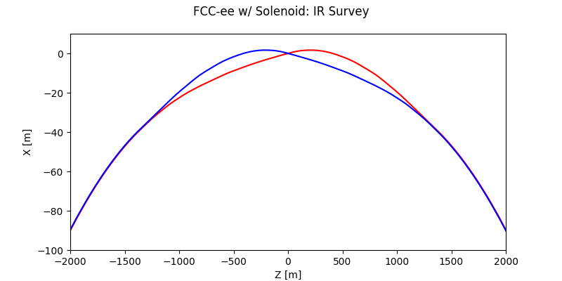
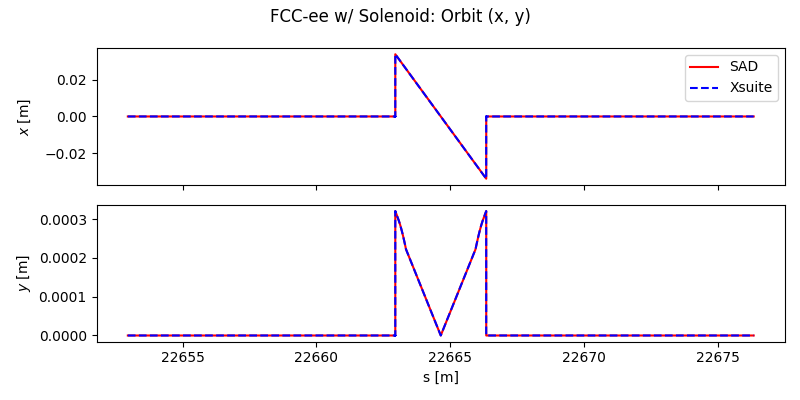
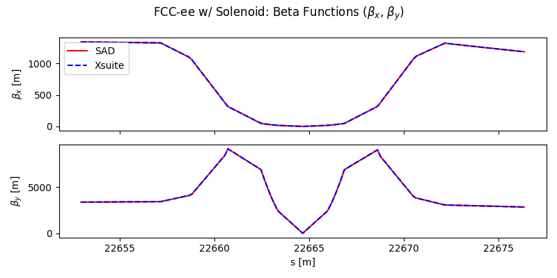
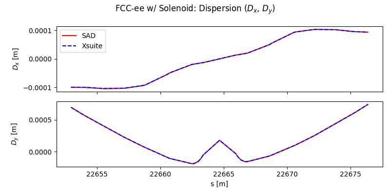

# SAD2XS: The (Unofficial) Strategic Accelerator Design (SAD) to Xsuite Converter

[](https://doi.org/10.5281/zenodo.18985396)
[](https://pypi.org/project/sad2xs/)
[](https://github.com/JPTS2/sad2xs/blob/main/LICENSE)
[](https://github.com/JPTS2/sad2xs/actions/workflows/run_tests.yml)
[](https://github.com/JPTS2/sad2xs/actions/workflows/docker-build.yml)

SAD2XS is a lattice conversion tool.
The input is a SAD lattice (.sad format).
The converter outputs an Xtrack Line object, and generates a lattice and optics file.
The lattice file generates the lattice from base elements.

<table>
<tr>
<td width="50%"></td>
<td width="50%"></td>
</tr>
<tr>
<td width="50%"></td>
<td width="50%"></td>
</tr>
</table>

## Project status
SAD2XS is in production use.
It is used for SuperKEKB modelling within the Belle II MDI Simulation and Modelling subgroup.

The converter is validated against the SuperKEKB electron and positron transfer lines (BTe and BTp), the SuperKEKB Low Energy Ring (LER) and High Energy Ring (HER), the J-PARC Main Ring, FCC-ee, and ATF2.
The KEK LINAC is not yet validated.

The converter is pre-1.0.
The public API and the generated lattice format may still change between minor releases.

## Installation
SAD2XS requires Python 3.13 or newer.

Install the converter from PyPI:

```bash
pip install sad2xs
```

Two optional extras are available:

```bash
# SAD helper functions, which also need a working SAD executable
pip install sad2xs[sad-helpers]

# Comparison plotting
pip install sad2xs[plotting]
```

### The SAD executable

`sad-helpers` runs `sad` as a subprocess, so SAD itself has to be built. To build it from source:

```bash
sad2xs-install-sad
```

The source tree goes to `~/.local/share/sad2xs` and the `sad` launcher to
`~/.local/bin`. The clone, the build, the build logs, and the launcher are all
owned by you. SAD2XS never invokes `sudo` and never asks for a password.

SAD2XS also never installs system dependencies. The installer probes for what
the build needs, and when anything is missing it lists every missing item with
the command that provides it, then exits without touching SAD:

```
Missing dependencies required to build SAD:

  nroff
      Needed to format SAD's libtai man pages during the build.
      Install with: brew install groff

  /opt/X11/include/X11/Xlib.h
      Needed to build SAD against X11.
      Install with: brew install --cask xquartz

SAD2XS never installs system dependencies and never uses sudo.
Install the above yourself, then rerun sad2xs-install-sad.
```

Run those commands yourself, then rerun `sad2xs-install-sad`.

The build ignores any active conda environment: SAD is compiled against the
platform toolchain, which on macOS means Xcode plus Homebrew's gfortran, so
that it does not depend on which environment happens to be active when it
runs. The dependency check searches that same toolchain PATH, so a command
supplied only by conda is reported missing rather than disappearing once the
build starts.

Both locations can be moved, which matters on a filesystem that is slow or
quota-limited:

```bash
sad2xs-install-sad --prefix /scratch/$USER/sad --bin-dir ~/bin
sad2xs-install-sad --reuse-clone   # rebuild in place, without re-cloning
```

The installer never edits your shell configuration. If the launcher directory
is not on your PATH it prints the exact line to add.

`--reuse-clone` keeps the existing checkout, and requires it to match
`--repo-url` and any explicit `--branch`; a mismatch is refused rather than
silently built. A `--branch` you name yourself must exist on the remote, so a
typo fails instead of installing the default branch.

Currently macOS only; on any other platform the command exits saying so.

## Usage
Convert a SAD lattice to an Xsuite line in one call:

```python
import sad2xs

line = sad2xs.convert_sad_to_xsuite(
    sad_lattice_path = "lattice.sad",
    output_directory = "output",
    line_name        = "RING")
```

The call returns an `xt.Line`.
It also writes a lattice file and an optics file to the output directory, then reloads the line from those files, so the returned line matches the generated output.

See [examples](examples/) for complete conversion scripts.

## Documentation
Project documentation lives in [docs](docs/README.md), covering the package architecture, the conversion model, SAD behaviour notes, the testing policy, the release procedure, and the design decisions behind the converter.

The test suite covers parser, converter elements, conversion pipeline, writer, SAD helpers, examples, installation, packaging, and CI configuration.
See [docs/development/testing.md](docs/development/testing.md) for full details.

## Limitations
The quadrupole fringe is converted as a thin second-order Taylor map.
This reproduces the optics correctly.
It is not known whether the map radiates, and this is untested.
Treat radiation results through quadrupole fringes with caution.

For the current list of open issues, see the [GitHub issue tracker](https://github.com/JPTS2/sad2xs/issues).

## Studies using SAD2XS
SAD2XS has been used in the following studies:

- J. P. T. Salvesen, "Development of Interaction Point Feedback Systems for CERN's Future Circular Lepton Collider", DPhil thesis, University of Oxford, 2026. [doi:10.5287/ora-kkqa6b0xr](https://doi.org/10.5287/ora-kkqa6b0xr)
- N. Z. van Gils *et al.*, "SuperKEKB Beam Transport Tracking and Dynamic Aperture Comparison as an Approximation for Injection Efficiency", IPAC'26, Deauville, France, 2026. [doi:10.18429/JACoW-IPAC2026-MOP1080](https://doi.org/10.18429/JACoW-IPAC2026-MOP1080)
- G. Nigrelli *et al.*, "Simulations and Measurements of Injection Backgrounds at SuperKEKB", IPAC'26, Deauville, France, 2026. [doi:10.18429/JACoW-IPAC2026-MOP1016](https://doi.org/10.18429/JACoW-IPAC2026-MOP1016)
- J. P. T. Salvesen *et al.*, "Modelling Optics and Beam-Beam Effects of SuperKEKB with Xsuite", IPAC'25, Taipei, Taiwan, 2025, pp. 382-385. [doi:10.18429/JACoW-IPAC2025-MOPM034](https://doi.org/10.18429/JACoW-IPAC2025-MOPM034)
- G. Broggi *et al.*, "Comparison of Xsuite Simulations with Measured Backgrounds at SuperKEKB", IPAC'25, Taipei, Taiwan, 2025, pp. 1098-1101. [doi:10.18429/JACoW-IPAC2025-MOPM035](https://doi.org/10.18429/JACoW-IPAC2025-MOPM035)
- J. P. T. Salvesen *et al.*, "Consistent Representation of Lattices Between Optics Codes for FCC-ee, SuperKEKB, and More", eeFACT 2025, Tsukuba, Japan, 2025.

## Citing SAD2XS
If you use SAD2XS in your work, please cite the archived software release.

    J. P. T. Salvesen, "SAD2XS: The unofficial Strategic Accelerator Design
    (SAD) to Xsuite converter". Zenodo. https://doi.org/10.5281/zenodo.18985396

This DOI always resolves to the most recent release.
To cite a specific version instead, use the version DOI shown on that release's Zenodo record.

GitHub generates APA and BibTeX from `CITATION.cff` via the "Cite this repository" button.

No dedicated paper on SAD2XS has been published.
The converter is also described in the eeFACT 2025 proceedings listed above.

## Support
For converter problems, please use the public GitHub tracker in the first instance.

For any further discussion, please contact john.salvesen@cern.ch with queries.

## Authors and acknowledgment
Written by John P. T. Salvesen in the context of his DPhil at the University of Oxford, "Development of Interaction Point Feedback Systems for CERN's Future Circular Lepton Collider", listed above.

With thanks to the following for their vital support:
- To Giovanni Iadarola for his vital support of this project.
- To Katsunobu Oide and Giacomo Broggi for their discussion and expertise on SAD
- To Ghislain Roy for his support in testing across many different lattices.

With thanks also to FCCIS and EAJADE for their support and funding to enable this work.

### EAJADE
This work was partially supported by the European Union's Horizon Europe Marie Sklodowska-Curie Staff Exchanges programme under grant agreement no. 101086276.


### FCCIS
This project has received funding from the European Union's Horizon 2020 research and innovation programme under grant agreement No 951754.


### SAD
With thanks to all the developers of SAD.
The SAD documentation was used extensively in this comparison, available at [SAD](https://acc-physics.kek.jp/SAD/).
The version of SAD used in comparisons is Katsunobu Oide's version, available at [SAD GitHub](https://github.com/KatsOide/SAD).

### Xsuite
With thanks to all the developers of Xsuite.
The Xsuite documentation was used extensively in this comparison, available at [Xsuite](https://xsuite.readthedocs.io/).
The version of Xsuite used in comparisons is the latest version, available at [Xsuite GitHub](https://github.com/xsuite).

## License
This project is licensed under the Apache License Version 2.0

---
Part of the SAD2XS project — the unofficial Strategic Accelerator Design (SAD) to Xsuite converter.
SPDX-License-Identifier: Apache-2.0
